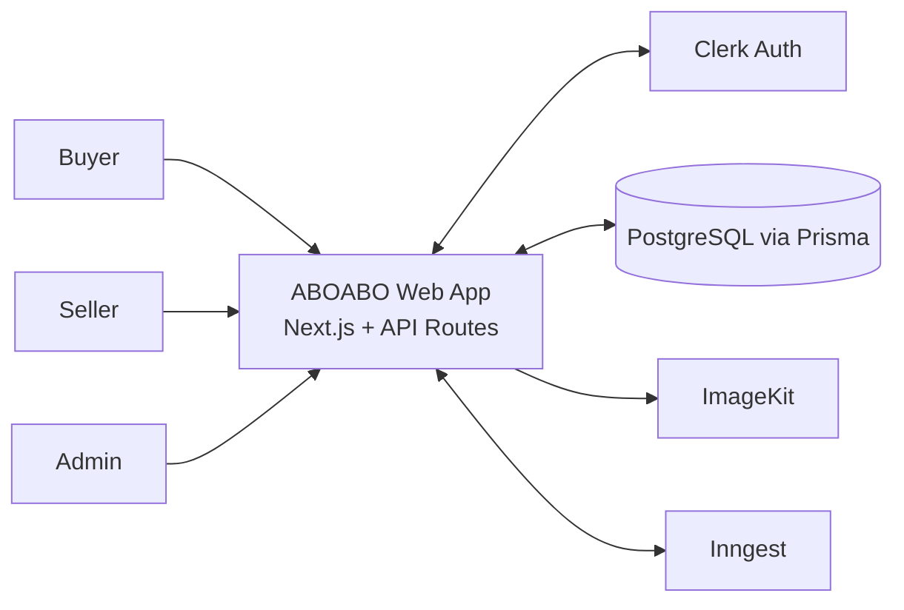
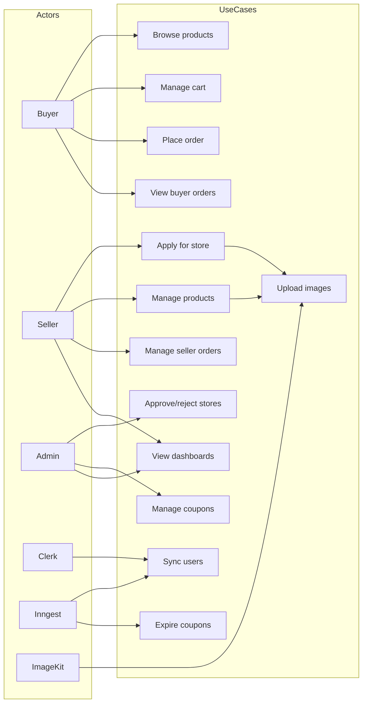
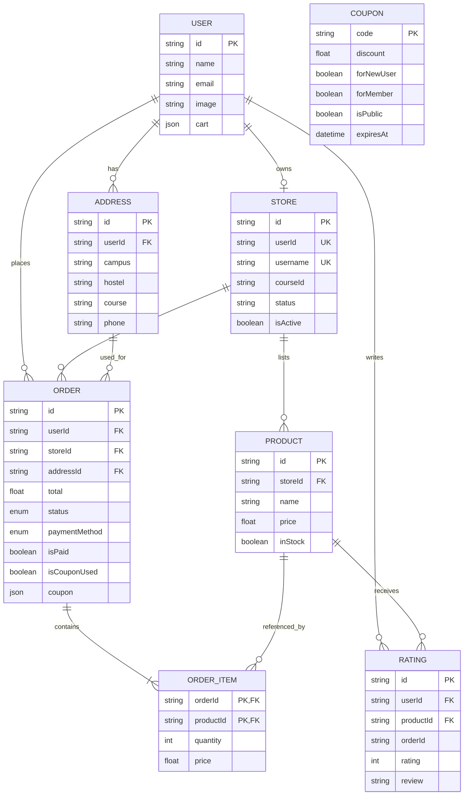
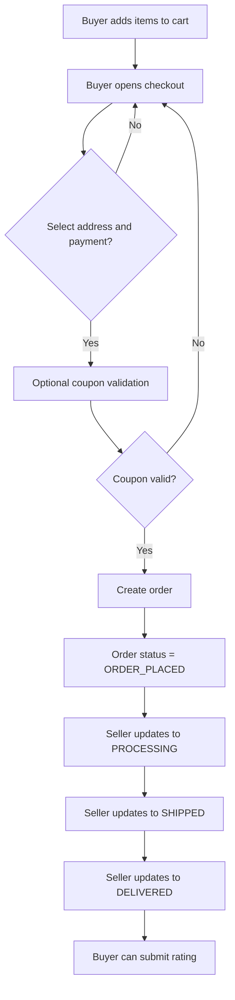
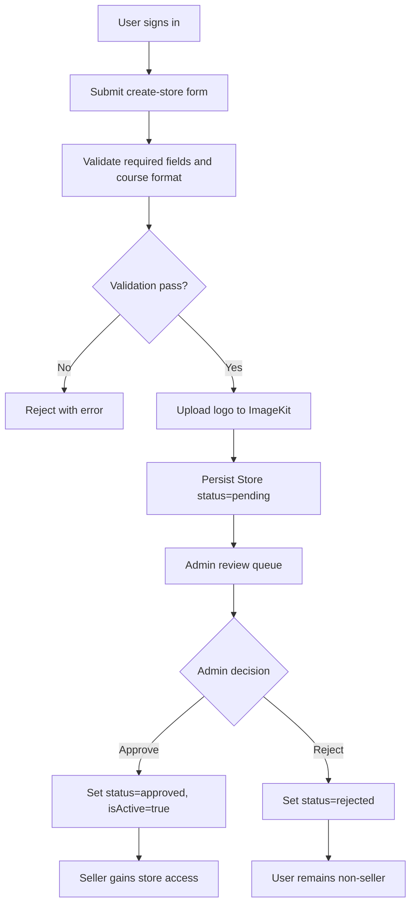

# Software Requirements Specification (SRS)
## ABOABO Student Marketplace

Version: 1.0 (Code-Derived Baseline)  
Date: 2026-04-20  
Spec Mode: As-Is + Gap-to-Be  
Release Posture: Prototype/Demo

## 1. Introduction

### 1.1 Purpose
This Software Requirements Specification defines the current and target requirements for ABOABO, a student-focused marketplace application. The document is derived from the current source code and runtime flow implementation.

This SRS separates:
- **As-Is requirements**: currently implemented and evidenced in code.
- **Gap-to-Be requirements**: required but currently missing/incomplete for a usable prototype.

### 1.2 Scope
ABOABO provides:
- Public buyer-facing product browsing/cart/order UX.
- Seller onboarding and seller operations (products, stock, store orders, seller analytics).
- Admin operations (store approval, store activation, coupon management, admin analytics).
- Background event handling for user sync and coupon expiry scheduling.

### 1.3 Definitions and Acronyms
- **As-Is**: Behavior already implemented in code.
- **Gap-to-Be**: Requirement not yet implemented but required.
- **Clerk**: Authentication and user identity provider.
- **Prisma**: ORM for PostgreSQL data access.
- **Inngest**: Event and background workflow system.
- **ImageKit**: Media upload and optimization service.

### 1.4 References (Code Evidence)
- API routes: `app/api/**`
- UI routes: `app/(public)/**`, `app/store/**`, `app/admin/**`
- Data model: `prisma/schema.prisma`
- Auth guards: `middlewares/authSeller.js`, `middlewares/authAdmin.js`
- Background jobs: `inngest/functions.ts`

## 2. Overall Description

### 2.1 Product Perspective
ABOABO is a Next.js App Router web application with Clerk auth, Prisma/PostgreSQL persistence, ImageKit media storage, Redux client state, and Inngest background orchestration.

### 2.2 User Classes and Actors
- **Buyer**: browses products, manages cart, places orders, tracks orders, rates delivered products.
- **Seller**: submits store application, manages approved store products/orders/stock, views seller dashboard.
- **Admin**: approves/rejects stores, toggles active status, manages coupons, views platform metrics.
- **System External Actors**:
  - Clerk (identity and user lifecycle events)
  - Inngest (event scheduler/runner)
  - ImageKit (asset upload/transformation)
  - PostgreSQL (persistent datastore)

### 2.3 Constraints
- Node 20 runtime (`package.json` engines).
- Authentication via Clerk token/session model.
- Current Prisma schema drives entity shape and relations.
- Current seller authorization requires store status = `approved`.
- Prototype scope allows selected placeholder UX, but core marketplace flows must be operational.

### 2.4 Dependencies
- `@clerk/nextjs`
- `@prisma/client` + Prisma CLI
- `inngest`
- `@imagekit/nodejs`
- `react-redux` / Redux Toolkit

## 3. Functional Requirements

Status markers:
- **[AS-IS]** Implemented.
- **[GAP-TO-BE]** Required but not implemented/complete.

### 3.1 Auth and User Sync Domain
- **FR-AUTH-01 [AS-IS]**: System shall authenticate users using Clerk and derive user identity from request context for protected APIs.
- **FR-AUTH-02 [AS-IS]**: System shall synchronize user lifecycle events (create, update, delete) from Clerk into local `User` table through Inngest handlers.
- **FR-AUTH-03 [AS-IS]**: System shall determine admin authorization by matching authenticated email against `ADMIN_EMAIL` environment variable list.
- **FR-AUTH-04 [AS-IS]**: System shall determine seller authorization only when linked store status is `approved`.
- **FR-AUTH-05 [GAP-TO-BE]**: System shall enforce unauthorized access behavior consistency across all protected endpoints with normalized error schema.

### 3.2 Seller Onboarding and Store Domain
- **FR-SELLER-01 [AS-IS]**: System shall accept store application submission with name, username, course ID, description, email, contact, address, logo.
- **FR-SELLER-02 [AS-IS]**: System shall validate course ID format (`AAA/0000/00`) and uniqueness.
- **FR-SELLER-03 [AS-IS]**: System shall validate unique store username (case-insensitive).
- **FR-SELLER-04 [AS-IS]**: System shall persist seller store application in `pending` status and link store to user.
- **FR-SELLER-05 [AS-IS]**: System shall support store status retrieval for applicant (`approved`, `rejected`, `pending`, `not registered`).
- **FR-SELLER-06 [AS-IS]**: Admin shall approve/reject store applications.
- **FR-SELLER-07 [AS-IS]**: Admin shall toggle approved store active state (`isActive`) independently from approval state.
- **FR-SELLER-08 [GAP-TO-BE]**: System shall fix and enforce invalid course ID length rejection response flow where response is currently not returned in one branch.

### 3.3 Seller Product and Operations Domain
- **FR-SPROD-01 [AS-IS]**: Approved seller shall create products with name, description, mrp, price, category, and one or more images.
- **FR-SPROD-02 [AS-IS]**: System shall upload product images to ImageKit and persist optimized URLs.
- **FR-SPROD-03 [AS-IS]**: Seller shall retrieve their own product list.
- **FR-SPROD-04 [AS-IS]**: Seller shall toggle stock availability for own product records.
- **FR-SPROD-05 [AS-IS]**: Seller shall retrieve store orders including buyer, address, and order items.
- **FR-SPROD-06 [AS-IS]**: Seller shall update order status (`ORDER_PLACED`, `PROCESSING`, `SHIPPED`, `DELIVERED`) for own-store orders.
- **FR-SPROD-07 [AS-IS]**: Seller shall retrieve dashboard summary (orders, earnings, product count, ratings list).

### 3.4 Buyer Marketplace and Order Domain
- **FR-BUY-01 [AS-IS]**: Buyer shall browse homepage and product detail pages using loaded product state.
- **FR-BUY-02 [AS-IS]**: Buyer shall add/remove items in cart using Redux-based cart state.
- **FR-BUY-03 [AS-IS]**: Buyer shall be able to open checkout panel with payment selection, address selection/addition UI, and coupon input field.
- **FR-BUY-04 [GAP-TO-BE]**: System shall persist buyer cart, addresses, and order creation to backend; current buyer checkout flow is not integrated.
- **FR-BUY-05 [GAP-TO-BE]**: System shall provide real buyer order history retrieval endpoint and render from API, replacing dummy order data.
- **FR-BUY-06 [GAP-TO-BE]**: System shall implement rating submission persistence API and update product ratings; current modal does not persist.
- **FR-BUY-07 [GAP-TO-BE]**: System shall integrate public store page with `/api/store/data` instead of dummy store/product data.

### 3.5 Admin Domain
- **FR-ADMIN-01 [AS-IS]**: Admin shall view dashboard metrics (orders, stores, products, revenue + order time-series dataset).
- **FR-ADMIN-02 [AS-IS]**: Admin shall view pending/rejected store applications for approval workflow.
- **FR-ADMIN-03 [AS-IS]**: Admin shall view approved stores list and toggle active flag.
- **FR-ADMIN-04 [AS-IS]**: Admin shall create, list, and delete coupons.
- **FR-ADMIN-05 [GAP-TO-BE]**: Admin flows shall receive normalized success/error payload contract and operational audit logs for key state changes.

### 3.6 Coupon and Background Jobs Domain
- **FR-COUPON-01 [AS-IS]**: Coupon creation shall schedule expiry event through Inngest.
- **FR-COUPON-02 [AS-IS]**: Background worker shall delete coupon at expiry timestamp.
- **FR-COUPON-03 [GAP-TO-BE]**: Buyer checkout shall validate coupon code against coupon table with expiry and rule checks before order placement.
- **FR-COUPON-04 [GAP-TO-BE]**: Inngest event naming shall be consistent between publisher and handler trigger (`app/coupon.expired` vs `app/coupon.expiry` mismatch).

## 4. Non-Functional Requirements

### 4.1 Security and Authorization
- **NFR-SEC-01**: All seller/admin endpoints shall require authenticated identity and role checks.
- **NFR-SEC-02**: Sensitive operations (store approval, coupon mutation, stock toggle, order status update) shall enforce ownership/role constraints in backend.
- **NFR-SEC-03**: Input validation shall reject malformed data before persistence.
- **NFR-SEC-04**: Environment secrets (DB URL, Clerk, ImageKit, admin email list) shall remain server-side only.

### 4.2 Data Integrity
- **NFR-DATA-01**: Referential integrity shall be maintained for all Prisma relations.
- **NFR-DATA-02**: Unique constraints for store user ownership, username, and coupon code shall be preserved.
- **NFR-DATA-03**: Order status transitions shall only use enum-defined values.
- **NFR-DATA-04**: Address and checkout contracts shall align with persisted schema to prevent invalid order records.

### 4.3 Availability and Reliability (Prototype Targets)
- **NFR-AVAIL-01**: System should target 99.0% monthly availability in prototype hosting.
- **NFR-AVAIL-02**: API failures shall return machine-readable error payloads and non-2xx status codes.
- **NFR-AVAIL-03**: Background job failures shall be observable in Inngest logs and retriable.

### 4.4 Performance
- **NFR-PERF-01**: Common API reads (dashboard aggregates, store data, store products/orders) should complete within 1.5s p95 under prototype load.
- **NFR-PERF-02**: Initial page navigation for primary buyer routes should complete within 2.5s on standard broadband.
- **NFR-PERF-03**: Product/store image delivery should use optimized transformed images where configured.

### 4.5 Observability and Logging
- **NFR-OBS-01**: Server routes shall log failures with context sufficient for diagnosis.
- **NFR-OBS-02**: Critical admin mutations should be auditable (who changed what and when).
- **NFR-OBS-03**: Client error toasts shall map to API error messages when available.

### 4.6 Usability and Accessibility
- **NFR-UX-01**: All major flows shall provide loading and success/failure feedback.
- **NFR-UX-02**: Forms shall include required field validation and informative messages.
- **NFR-UX-03**: Primary pages shall maintain responsive behavior across mobile and desktop.

### 4.7 Maintainability
- **NFR-MAINT-01**: Requirements traceability IDs shall map to code modules/routes for change impact analysis.
- **NFR-MAINT-02**: API contracts shall remain documented and versionable.
- **NFR-MAINT-03**: Placeholder/demo datasets must be explicitly marked and replaced in production tracks.

## 5. As-Is API Inventory and Role Guards

| API Route | Method(s) | Purpose | Auth Guard | As-Is Status |
|---|---|---|---|---|
| `/api/store/create` | `POST` | Submit store application | Authenticated user via Clerk | Implemented |
| `/api/store/create` | `GET` | Check applicant store status | Authenticated user via Clerk | Implemented |
| `/api/store/is-seller` | `GET` | Validate seller access and fetch store info | `authSeller` | Implemented |
| `/api/store/product` | `POST` | Add seller product | `authSeller` | Implemented |
| `/api/store/product` | `GET` | List seller products | `authSeller` | Implemented |
| `/api/store/stock-toggle` | `POST` | Toggle product stock | `authSeller` + ownership | Implemented |
| `/api/store/orders` | `GET` | List seller store orders | `authSeller` | Implemented |
| `/api/store/orders` | `POST` | Update seller order status | `authSeller` + ownership | Implemented |
| `/api/store/dashboard` | `GET` | Seller metrics and reviews | `authSeller` | Implemented |
| `/api/store/data` | `GET` | Public store + in-stock products by username | Public | Implemented |
| `/api/admin/is-admin` | `GET` | Validate admin access | `authAdmin` | Implemented |
| `/api/admin/approve-store` | `GET` | List pending/rejected stores | `authAdmin` | Implemented |
| `/api/admin/approve-store` | `POST` | Approve/reject store | `authAdmin` | Implemented |
| `/api/admin/stores` | `GET` | List approved stores | `authAdmin` | Implemented |
| `/api/admin/toggle-store` | `POST` | Toggle store active status | `authAdmin` | Implemented |
| `/api/admin/dashboard` | `GET` | Platform metrics for admin | `authAdmin` | Implemented |
| `/api/admin/coupon` | `GET` | List coupons | `authAdmin` | Implemented |
| `/api/admin/coupon` | `POST` | Create coupon and schedule expiry | `authAdmin` | Implemented |
| `/api/admin/coupon` | `DELETE` | Delete coupon | `authAdmin` | Implemented |
| `/api/inngest` | `GET`,`POST`,`PUT` | Inngest serve endpoint | Inngest integration | Implemented |

## 6. Gap-to-Be Interface Contracts (Required)

### 6.1 Buyer Order APIs

#### `POST /api/orders`
- **Auth**: Required (buyer).
- **Purpose**: Create order from selected cart items and address.
- **Request Body**:
  - `items`: `[{ productId: string, quantity: number }]`
  - `addressId`: `string`
  - `paymentMethod`: enum (`COD` for prototype mandatory)
  - `couponCode`: optional `string`
- **Server Rules**:
  - Validate product existence and stock.
  - Recompute line totals server-side.
  - Apply coupon only if valid and not expired.
  - Persist `Order` + `OrderItem`; set `isPaid=false` for COD.
- **Response**:
  - `201` `{ orderId, total, status }`
  - `4xx` with standardized error payload.

#### `GET /api/orders`
- **Auth**: Required (buyer).
- **Purpose**: Retrieve authenticated buyer orders with order items, store, and address.
- **Response**: `200 { orders: Order[] }` sorted newest first.

### 6.2 Address Persistence API (Aligned to Existing Schema)

#### `POST /api/addresses`
- **Auth**: Required.
- **Request Body (schema-aligned)**:
  - `name`, `email`, `campus`, `hostel`, `course`, `phone`
- **Response**: `201 { address }`

#### `GET /api/addresses`
- **Auth**: Required.
- **Response**: `200 { addresses: Address[] }`

Requirement note: Existing UI currently captures `street/city/state/zip/country` in modal. Prototype must either:
1. map UI fields to `campus/hostel/course/phone`, or
2. migrate Prisma address schema and dependent views.

### 6.3 Coupon Validation API

#### `POST /api/coupon/validate`
- **Auth**: Required.
- **Request Body**: `{ code: string, cartSubtotal: number }`
- **Rules**:
  - Coupon exists and not expired.
  - Rule checks: `forNewUser`, `forMember`, `isPublic`.
  - Return applied discount amount and revised total.
- **Response**:
  - `200 { valid: true, coupon, discountAmount, finalTotal }`
  - `400/404 { valid: false, error }`

## 7. Acceptance Criteria by Feature Area

### 7.1 Auth and User Sync
- Clerk-authenticated protected requests without proper role are rejected with non-2xx status.
- Clerk user create/update/delete events produce corresponding database mutations.

### 7.2 Seller Onboarding and Approval
- Valid store application persists with pending status and linked user/store relation.
- Duplicate username or duplicate course ID is rejected.
- Admin can approve/reject, and approved seller access is granted by `authSeller`.

### 7.3 Seller Operations
- Approved seller can add product with uploaded images and retrieve product list.
- Seller can toggle own product stock state.
- Seller can update order status only for own store orders.

### 7.4 Buyer Checkout and Orders
- Buyer can submit order through backend API with server-side total validation.
- Buyer order history page renders persisted orders, not dummy data.
- Checkout with invalid coupon fails with clear error; valid coupon updates totals.

### 7.5 Admin and Coupons
- Admin dashboard returns aggregate counts and revenue data.
- Admin can create/list/delete coupons.
- Coupon expiry workflow removes expired coupons automatically.

### 7.6 Public Store and Product Discovery
- `/shop/[username]` loads store and product data from backend endpoint.
- Inactive or missing stores return explicit not-found behavior.

## 8. Traceability Matrix (Requirements to Code)

| Requirement ID | Primary Code Evidence |
|---|---|
| FR-AUTH-02 | `inngest/functions.ts` |
| FR-AUTH-03 | `middlewares/authAdmin.js` |
| FR-AUTH-04 | `middlewares/authSeller.js` |
| FR-SELLER-01..05 | `app/api/store/create/route.js`, `app/(public)/create-store/page.jsx` |
| FR-SELLER-06 | `app/api/admin/approve-store/route.js` |
| FR-SELLER-07 | `app/api/admin/toggle-store/route.js` |
| FR-SPROD-01..03 | `app/api/store/product/route.js`, `app/store/add-product/page.jsx`, `app/store/manage-product/page.jsx` |
| FR-SPROD-04 | `app/api/store/stock-toggle/route.js` |
| FR-SPROD-05..06 | `app/api/store/orders/route.js`, `app/store/orders/page.jsx` |
| FR-SPROD-07 | `app/api/store/dashboard/route.js`, `app/store/page.jsx` |
| FR-BUY-01..03 | `app/(public)/page.jsx`, `app/(public)/product/[productId]/page.jsx`, `app/(public)/cart/page.jsx`, `components/OrderSummary.jsx` |
| FR-BUY-05 | `app/(public)/orders/page.jsx` (gap evidenced by dummy data use) |
| FR-BUY-07 | `app/(public)/shop/[username]/page.jsx`, `app/api/store/data/route.js` |
| FR-ADMIN-01 | `app/api/admin/dashboard/route.js`, `app/admin/page.jsx` |
| FR-ADMIN-02 | `app/api/admin/approve-store/route.js`, `app/admin/approve/page.jsx` |
| FR-ADMIN-03 | `app/api/admin/stores/route.js`, `app/api/admin/toggle-store/route.js`, `app/admin/stores/page.jsx` |
| FR-ADMIN-04 | `app/api/admin/coupon/route.js`, `app/admin/coupons/page.jsx` |
| FR-COUPON-01..02 | `app/api/admin/coupon/route.js`, `inngest/functions.ts` |

## 9. Diagram Pack (Mermaid)

### 9.1 System Context Diagram

### 9.2 Use Case Diagram

### 9.3 Entity Relationship Diagram

### 9.4 Order Lifecycle Flow Diagram

### 9.5 Store Onboarding and Approval Flow Diagram

## 10. SRS Test Plan (Artifact Validation)
- **Consistency pass**: Verify each FR tag maps to either existing code or explicit gap requirement.
- **Completeness pass**: Confirm each actor has at least one end-to-end flow including error/alternate path.
- **Interface pass**: Verify all required APIs include auth, request, response, and failure behavior.
- **Diagram pass**: Render all Mermaid blocks and confirm they match textual sections.
- **Terminology pass**: Confirm normalized names for statuses and flags, with mismatches explicitly listed.

## 11. Terminology and Value Normalization Notes

### 11.1 Canonical Status Values
- Store status: `pending`, `approved`, `rejected`
- Store activation: `isActive` boolean
- Order status: `ORDER_PLACED`, `PROCESSING`, `SHIPPED`, `DELIVERED`
- Payment method enum: `COD`, `STRIPE`, `MoMo`

### 11.2 Identified Mismatches (To Resolve)
1. Buyer order/rating UI includes value checks inconsistent with backend status casing in some component branches.
2. Address UI fields (`street/city/state/zip/country`) differ from Prisma schema (`campus/hostel/course/phone` + name/email).
3. Inngest event name mismatch between coupon publisher and coupon expiry handler trigger.
4. Some UI pages still consume dummy data where APIs exist.

## 12. Assumptions
- Prototype checkout uses COD as mandatory initial payment mode; Stripe/MoMo can remain unimplemented placeholders.
- Public store page must use backend store/product data for prototype readiness.
- Missing buyer APIs introduced in this SRS are considered required implementation scope, not optional enhancements.
- Logging/audit additions can be lightweight in prototype but must capture key mutation events.

